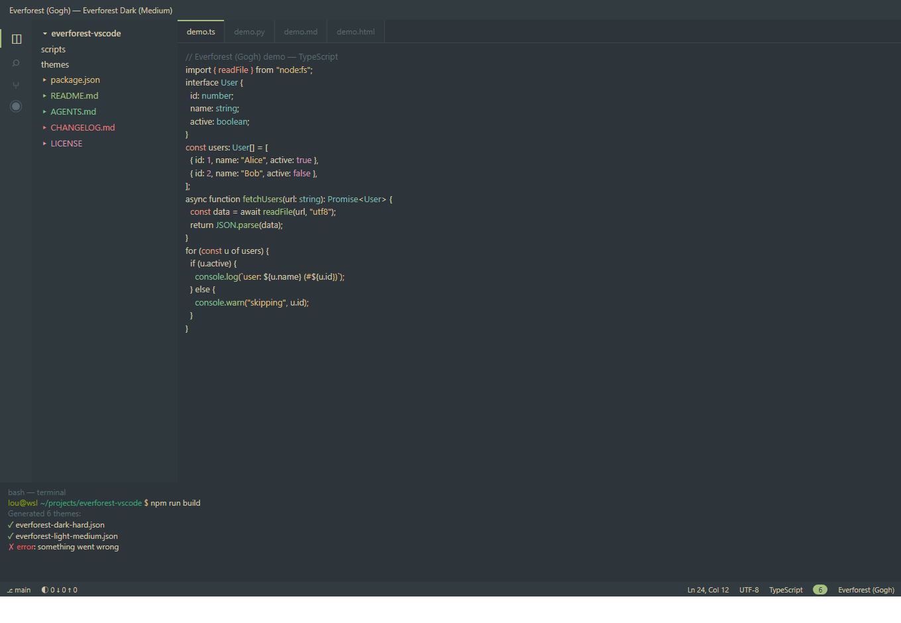
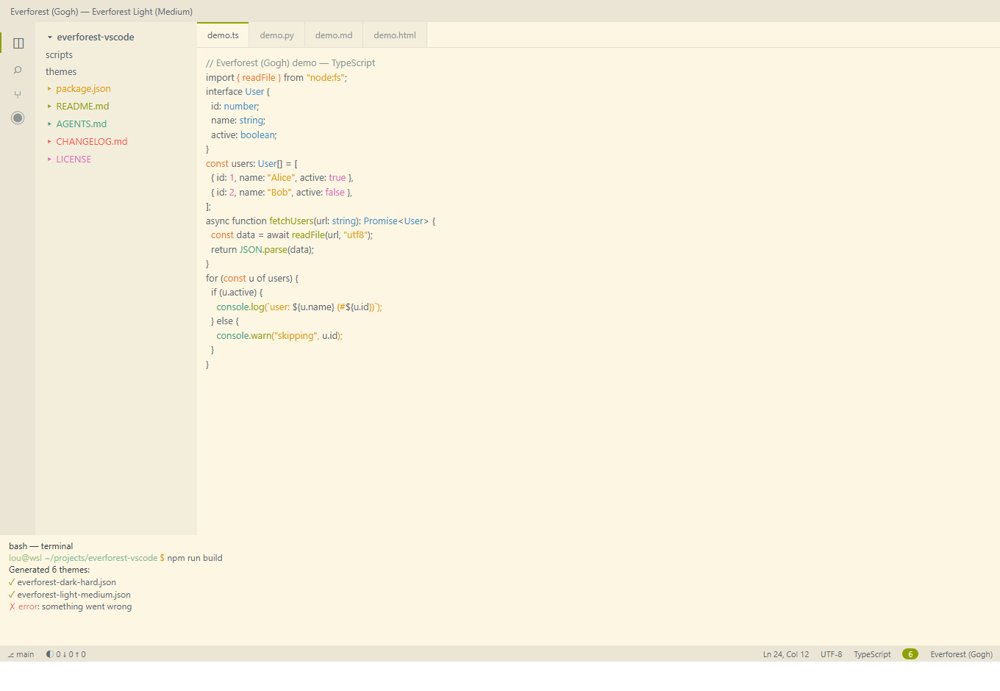

# Everforest (Gogh)

> Six Everforest color schemes (Dark/Light × Hard/Medium/Soft) for VS Code.

Warm, soft and eye-friendly — the 16 terminal ANSI colors match the original
[Gogh-Co](https://github.com/Gogh-Co/Gogh) Everforest palettes exactly.

## Features

- 🌿 **Warm, nature-inspired palette** — low contrast, gentle on the eyes
- 🌓 **Six variants** — Dark/Light × Hard/Medium/Soft for any ambient light
- 🎯 **Semantic highlighting** — syntax, HTML/CSS, Markdown and terminal all tuned
- 🖥️ **Faithful terminal colors** — the exact Gogh-Co 16-color ANSI palette
- 🌙 **Blue-light friendly** — pairs well with f.lux / Redshift

## Themes

| Theme | Type | Note |
|---|---|---|
| Everforest Dark (Hard) | dark | highest contrast |
| Everforest Dark (Medium) | dark | balanced (default) |
| Everforest Dark (Soft) | dark | softest for long sessions |
| Everforest Light (Hard) | light | highest contrast |
| Everforest Light (Medium) | light | balanced (default) |
| Everforest Light (Soft) | light | softest for long sessions |

## Quick Start

1. Grab the latest `.vsix` from the [Releases](https://github.com/Frost-rA9/everforest-vscode/releases) page
2. Install: `code --install-extension everforest-gogh-<version>.vsix`
3. Press `Ctrl+K Ctrl+T` and pick a variant

## Contributing

Tweak the derived colors in `scripts/templates/derived.mjs`, then
`npm run build` to regenerate the 6 theme files. See `AGENTS.md` for
conventions.

## Credits

- Color schemes: [Gogh-Co/Gogh](https://github.com/Gogh-Co/Gogh) (MIT)
- Official Everforest color scheme: <https://everforest.vercel.app/>

## License

MIT — see the LICENSE file in the repository root.
