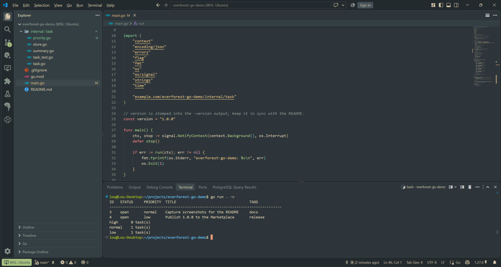
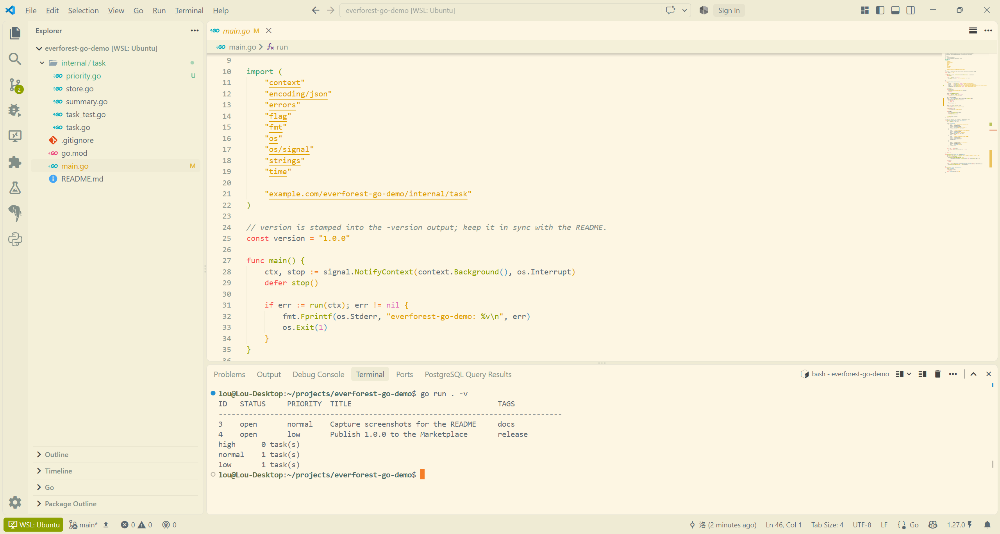
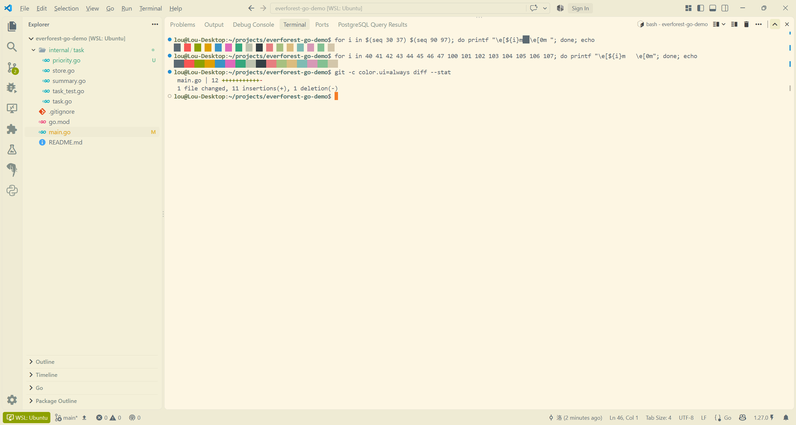
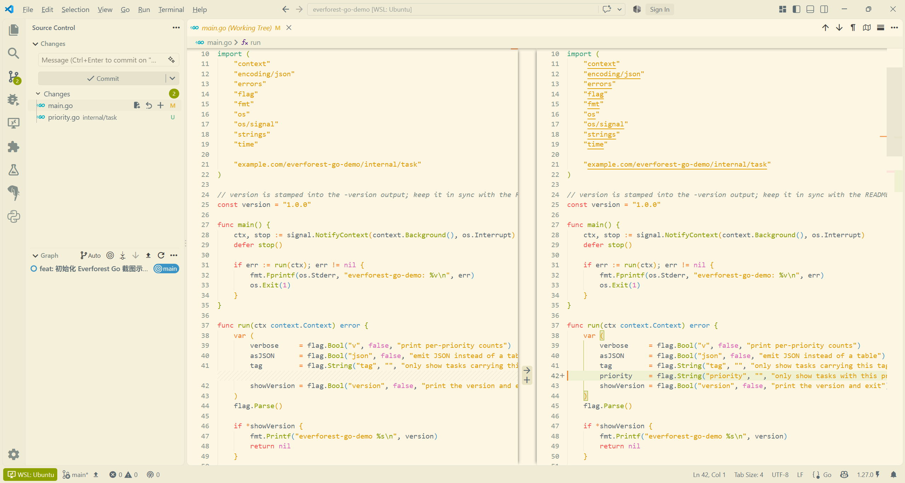

English | [简体中文](README.zh-cn.md)

# Everforest Remastered

Six static **Everforest** color schemes (Dark/Light × Hard/Medium/Soft) for
Visual Studio Code, built directly from the official Everforest palette.

Every accent, grey and background comes from the canonical
[Everforest](https://github.com/sainnhe/everforest) palette as published by
[everforest-web](https://github.com/SirEthanator/everforest-web). The VS Code
workbench surfaces and the 16-color terminal palette are derived from it — no
hand-tuned colors.



## Why Everforest Remastered?

The official VS Code port,
[sainnhe/everforest-vscode](https://github.com/sainnhe/everforest-vscode), is
archived and its last Marketplace release was v0.3.0 (December 2022). This
extension is a maintained remaster built on the same palette:

- **Six static themes** — pick Dark/Light × Hard/Medium/Soft once; no runtime
  settings, no reload
- **Canonical colors** — pinned to the upstream palette (the exact commit is
  recorded in the repository), not an approximation
- **Full workbench coverage** — editor, sidebar, tabs, panels, lists, menus,
  diff and diagnostics, Peek view, minimap and more
- **A real 16-color terminal** — normal and bright groups differ, so TUIs keep
  their emphasis
- **Zero runtime cost** — the themes are plain JSON, no extension host code

## Features

- 🌿 **Official palette** — accents, greys and the six background ramps are taken
  from the canonical Everforest scheme (via `everforest-web`)
- 🌓 **Six static variants** — Dark/Light × Hard/Medium/Soft, pick once and forget
- 🖥️ **Rich 16-color terminal** — the `terminal.ansi*` set is derived from the
  palette, with distinct normal and bright groups for TUIs
- 🎯 **Semantic highlighting** — syntax, HTML/CSS/Markdown, JSON/YAML/TOML, Rust,
  Go, Shell and Dockerfile all share one role mapping
- 🌙 **Blue-light friendly** — pairs well with f.lux / Redshift
- 🧩 **No configuration** — no settings to tune, no runtime overhead

## Themes

| Theme | Type | Note |
|---|---|---|
| Everforest Dark (Hard) | dark | highest contrast |
| Everforest Dark (Medium) | dark | balanced (default) |
| Everforest Dark (Soft) | dark | softest for long sessions |
| Everforest Light (Hard) | light | highest contrast |
| Everforest Light (Medium) | light | balanced (default) |
| Everforest Light (Soft) | light | softest for long sessions |

## Screenshots

### Light



### Terminal palette

Normal and bright groups rendered side by side in the integrated terminal.



### Diff view

Inserted lines pick up the upstream `Background Green` tint.



## Installation

### Marketplace

Search for **Everforest Remastered** in the Extensions view, or run:

```bash
code --install-extension Frost-rA9.everforest
```

### VSIX

Download `everforest-<version>.vsix` from
[Releases](https://github.com/Frost-rA9/everforest-vscode/releases), then:

```bash
code --install-extension everforest-<version>.vsix
```

### Remote / WSL

A color theme is a UI extension, so install it on the side that renders the
window (for example the Windows build when using Remote - WSL). Theme labels are
identical across variants, so switching with `Ctrl+K Ctrl+T` is enough.

## Terminal palette

`terminal.ansi*` is derived from the Everforest palette with two groups:

| Slot | Dark (Medium) | Light (Medium) |
|---|---|---|
| Black | `#343F44` | `#5C6A72` |
| Red | `#E67E80` | `#F85552` |
| Green | `#A7C080` | `#8DA101` |
| Yellow | `#DBBC7F` | `#DFA000` |
| Blue | `#7FBBB3` | `#3A94C5` |
| Magenta | `#D699B6` | `#DF69BA` |
| Cyan | `#83C092` | `#35A77C` |
| White | `#D3C6AA` | `#BDC3AF` |
| Bright Black | `#859289` | `#343F44` |
| Bright Red | `#F85552` | `#E67E80` |
| Bright Green | `#8DA101` | `#A7C080` |
| Bright Yellow | `#DFA000` | `#DBBC7F` |
| Bright Blue | `#3A94C5` | `#7FBBB3` |
| Bright Magenta | `#DF69BA` | `#D699B6` |
| Bright Cyan | `#35A77C` | `#83C092` |
| Bright White | `#D3C6AA` | `#D3C6AA` |

Values shown for the Medium variants; every variant is generated from
`scripts/palette/ansi.mjs`. To let the palette render exactly as designed, set
VS Code's terminal contrast adjustment to 1:

```json
{
  "workbench.colorTheme": "Everforest Dark (Medium)",
  "terminal.integrated.minimumContrastRatio": 1
}
```

## Migrating from `everforest-gogh`

The extension id changed to `Frost-rA9.everforest`, so the previous
`Frost-rA9.everforest-gogh` listing no longer receives updates. To migrate:

1. Uninstall the old extension (`code --uninstall-extension Frost-rA9.everforest-gogh`)
2. Install **Everforest Remastered** (`Frost-rA9.everforest`)
3. Done — theme labels are unchanged, so `workbench.colorTheme` keeps working

## Development

```bash
npm install
npm run build      # regenerate the six theme JSON files
npm run validate   # structure + upstream consistency + contrast checks
npm run preview    # render a mock VS Code layout to /tmp/efv-preview-<id>.html
npm run package    # build everforest-<version>.vsix
```

The palette data is vendored in `scripts/palette/everforest-web.mjs` and must stay
identical to upstream. Tune the VS Code derivation in
`scripts/templates/derived.mjs`, rebuild, then validate. See `AGENTS.md` for
conventions.

## Credits

- Palette: [SirEthanator/everforest-web](https://github.com/SirEthanator/everforest-web) (MIT),
  a faithful transcription of the official Everforest colors
- Official color scheme: [sainnhe/everforest](https://github.com/sainnhe/everforest) (MIT)
- VS Code derivation, workbench mapping and terminal palette: this project

## License

MIT — see the LICENSE file in the repository root.
